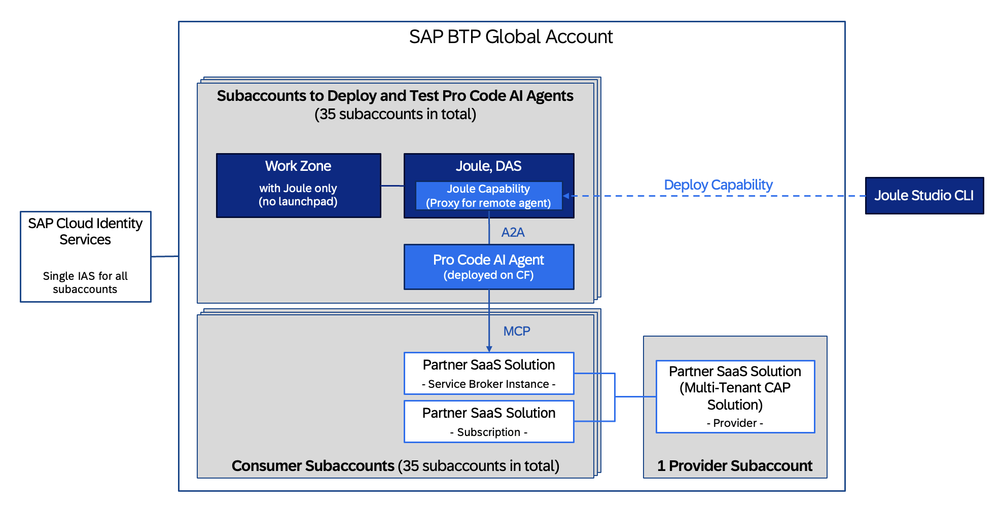
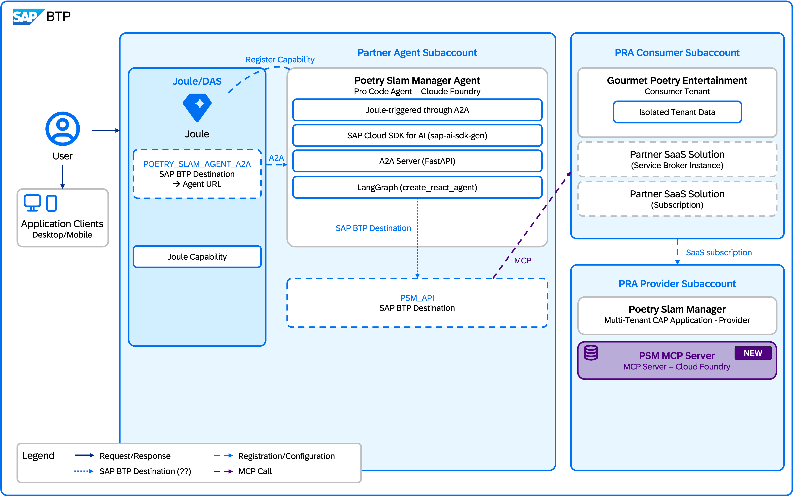

[](https://api.reuse.software/info/github.com/SAP-samples/partner-reference-application-joule-a2a-agent-workshop)

# Joule A2A Agent — Partner Reference Application

This repository contains the material for building a **Joule A2A (Agent-to-Agent) Agent** that connects SAP Joule to the multi-tenant CAP application using the A2A protocol and Model Context Protocol (MCP).

---

## Overview

In this codejam, you create a pro code AI agent that integrates with SAP Joule using the A2A protocol. The agent is built with **LangGraph** and connects to a multi-tenant CAP poetry slam manager application's MCP endpoint to discover and invoke tools dynamically, enabling Joule users to query poetry slam data using natural language.

> [!NOTE]
> The agent scaffolding and Joule capability definitions generated in this codejam target the current Joule Digital Assistant Service (DAS) APIs and the A2A v0.3 protocol.

### Basic Setup of Systems and Landscape

The solution spans multiple SAP BTP subaccounts and services working together:

- **SAP BTP Global Account** — Houses all subaccounts for agent deployment, testing, and the partner SaaS solution (provider and consumer).
- **Agent Deployment and Joule Subaccount** — Contains SAP Build Work Zone (with Joule only, no launchpad), Joule Digital Assistant Service (DAS), and the deployed pro code AI agent on SAP BTP, Cloud Foundry environment.
- **Consumer Subaccounts** — Subscribe to the partner's multi-tenant CAP solution using a Service Broker instance.
- **Provider Subaccount** — Hosts the multi-tenant CAP-based Poetry Slam Manager application that exposes the MCP endpoint.
  
**SAP Cloud Identity Services (IAS)** — A single IAS tenant shared across all subaccounts for unified authentication.

---
### System Landscape

The diagram below shows the complete system landscape including all subaccounts, services, and communication paths:



**Key components visible in the landscape:**

| Component | Role |
|-----------|------|
| **SAP Build Work Zone** (with Joule only) | Hosts the Joule conversational UI for end users |
| **Joule, DAS** | Digital Assistant Service — contains the Joule capability that acts as a proxy for the remote agent |
| **Joule Capability** | Deployed through Joule Studio CLI; defines how Joule routes requests to the agent |
| **Pro Code AI Agent** | LangGraph-based agent deployed on SAP BTP, Cloud Foundry environment; communicates upstream using A2A and downstream using MCP |
| **Partner SaaS Solution** | Multi-tenant CAP application (Poetry Slam Manager) exposing OData services and an MCP endpoint |
| **SAP Cloud Identity Services** | Provides authentication (IAS) across all subaccounts |

---

## Architecture

### SAP BTP Subaccount Setup

The diagram below shows the SAP BTP subaccount configuration for deploying and testing the pro code AI agent:



### How the Agent Is Built and Interacts

```
┌─────────────────────────────────────────────────────────────────────────┐
│  User (SAP Build Work Zone)                                             │
│       ↓  natural language query                                         │
│  Joule Digital Assistant                                                │
│       ↓  A2A Protocol (JSON-RPC over HTTPS)                             │
│  Pro Code AI Agent (LangGraph, deployed on CF)                          │
│       ↓  MCP (Model Context Protocol)                                   │
│  CAP Poetry Slam Manager (OData / CDS services)                         │
└─────────────────────────────────────────────────────────────────────────┘
```

**Step-by-step interaction flow:**

1. **User asks a question in Joule**: for example, *"Show me all upcoming poetry slams."* The request is sent from the Work Zone–embedded Joule chat to the Joule DAS back end.
2. **Joule resolves the user prompt** — Based on the deployed Joule Capability definition, Joule identifies that this query should be routed to the remote A2A agent and forwards the request using the **A2A protocol** (Google's open standard for agent-to-agent interoperability over JSON-RPC/HTTPS — see [Agent-to-Agent (A2A) Protocol](#agent-to-agent-a2a-protocol) below) through the configured SAP BTP destination.
3. **A2A Agent receives the task** — The agent, running as a Node.js CAP service on SAP BTP, Cloud Foundry environment, parses the incoming A2A request and extracts the user's natural language message.
4. **MCP tool discovery and execution** — On startup, the agent connects to the CAP application's MCP server endpoint (`/mcp`) using Streamable HTTP transport. **MCP** ([Model Context Protocol](https://modelcontextprotocol.io/) — an open standard for connecting LLMs to external data and tools; see [Model Context Protocol (MCP)](#model-context-protocol-mcp) below) enables dynamic tool discovery and invocation. It discovers available tools and invokes them with CQL queries constructed by the LLM.
5. **Response flows back** — The final LLM-generated answer is packaged as an A2A `Task` artifact and returned to Joule, which renders it in the conversational UI.

## Tech Stack

### LangGraph

[LangGraph](https://langchain-ai.github.io/langgraph/) is a framework for building stateful, multi-step AI agents as directed graphs. In this project:

- The agent is constructed as a **ReAct (Reason + Act) graph** where nodes represent LLM calls and tool executions.
- LangGraph manages the agent's state, including messages, tool calls, and results, across multiple reasoning steps.
- Built on top of LangChain.js, it uses the `@langchain/openai` package (through SAP AI Core proxy) and the `@langchain/langgraph` package.

### Joule Capability

A **Joule capability** is the mechanism SAP provides to extend Joule with custom skills:

- It is a set of YAML configuration files (`capability.sapdas.yaml`, `da.sapdas.yaml`, function definitions, and scenario definitions) that describe what the agent can do.
- The **capability** tells Joule: *"There is an external agent that can answer questions about poetry slams"* — including example utterances, function signatures, and routing rules.
- Capabilities are deployed using the **Joule CLI** (`@sap/joule-cli`), which pushes the definitions into the Joule DAS back end.
- At runtime, Joule uses the capability metadata to match user intents and route requests to the correct agent endpoint using SAP BTP destinations.

### Agent-to-Agent (A2A) Protocol

The [A2A protocol](https://google.github.io/A2A/) is Google's open standard for agent interoperability:

- It enables agents built with different frameworks to communicate using a standardized JSON-RPC interface.
- In this project, Joule acts as the **client** and the LangGraph agent acts as the **server**, exposing endpoints like `tasks/send` and `tasks/get`.
- The agent advertises its capabilities using an **Agent Card** (served at `/.well-known/agent.json`).

### Model Context Protocol (MCP)

[MCP](https://modelcontextprotocol.io/) is an open protocol for connecting LLMs to external data and tools:

- The CAP Poetry Slam Manager application exposes an MCP server endpoint that dynamically advertises available tools (derived from CDS service definitions).
- The agent's MCP client connects through **Streamable HTTP** transport, discovers tools, and invokes them with parameters determined by the LLM.

---

## SAP Build Work Zone Integration

SAP Build Work Zone serves as the **entry point for end users** to interact with the Joule-powered agent:

- **SAP Build Work Zone with Joule** — In this setup, Work Zone is configured with Joule only (no launchpad). It provides the embedded Joule conversational UI where users type natural language questions.
- **Joule Booster** — The SAP BTP Booster "Enable Joule" provisions all necessary services (Joule DAS, AI Core entitlements) and wires them into SAP Build Work Zone.
- **Destination-based routing** — SAP Build Work Zone with Joule uses a SAP BTP destination to communicate with the deployed A2A agent on SAP BTP, Cloud Foundry environment. The agent itself handles authentication to downstream services (e.g., the CAP Poetry Slam Manager) using `OAuth2ClientCredentials`. Principal propagation from Joule to the agent is out of scope for this exercise.

---

## Joule A2A Plugin (Agent Toolkit)

The [Joule A2A Agent Toolkit](https://github.com/SAP-samples/joule-a2a-agent-toolkit/) is a **Claude Code plugin** (set of CLAUDE.md instructions and prompt templates) that accelerates agent development:

- Provides scaffolding commands to generate the full A2A agent project structure (MTA, CAP service, LangGraph agent, and Joule capability YAML files).
- Encodes best practices for agent configuration, environment setup, and deployment.
- Used in **Exercise 1.1** to generate the agent code and Joule capability definitions interactively using Claude Code.

---

## Requirements

To follow the exercises in this repository, you need the following:

- An SAP BTP global account with Cloud Foundry environment enabled
- An SAP Identity Authentication Service (IAS) tenant
- Access to SAP AI Core with a deployed LLM model.
- A deployed CAP Poetry Slam Manager application with MCP endpoint.
- A subscription to the Poetry Slam Manager application.
- Node.js 24.x, VS Code, Claude Code cli, CF CLI v8, and Joule CLI

> [!NOTE]
> **CodeJam participants:** The following items are **pre-provisioned** for you and require no action on your part:
>
> - SAP BTP Global Account, subaccounts, and Cloud Foundry environment
> - SAP AI Core instance (extended plan) with SAP AI Core service key
> - CAP Poetry Slam Manager application (deployed) and your subscription to it
> - SAP Build Work Zone with Joule enabled (Joule Digital Assistant Service)
> - SAP Cloud Identity Services (IAS) tenant

## Exercises

### Getting Started (Exercise 0) — Environment Setup

Set up your local development tools and SAP BTP landscape before building the agent.

- [Setup of Local Environment](./docs/ex0/Setup-Local-Environment.md) — Install Node.js, VS Code, Claude Code, CF CLI, MBT, CDS DK, Joule CLI, and clone the Joule A2A Agent Toolkit
- [Setup of Joule and SAP Build Work Zone](./docs/ex0/Setup-Joule-Workzone.md) — Configuration of SAP Build Work Zone and Joule, including integration of Joule with SAP Build Work Zone and enabling Joule functionality within the site (already preconfigured for this workshop for your convenience).
- [Notes](./docs/Notes.md) - A centralized location to store important details, such as service bindings and configuration values, for easy reference throughout the workshop.

### Exercise 1 — Build, Deploy, and Integrate the A2A Agent with Joule

Develop the agent using Claude Code with the Joule A2A Agent Toolkit plugin, deploy it to SAP BTP, Cloud Foundry environment, and wire it into Joule.

- [Exercise 1.1 — Develop Pro Code Agent and Joule Capabilities](./docs/ex1/1.1-Develop-Agent-And-Joule-Capabilities.md) — Use the Joule A2A Agent Toolkit (Claude Code plugin) to scaffold the complete A2A agent project, configure local environment variables, and verify the agent works locally with test curl commands
- [Exercise 1.2 — Deploy Pro Code Agent and Joule Capabilities](./docs/ex1/1.2-Deploy-Agent-And-Joule-Capabilities.md) — Build the MTA archive, deploy to SAP BTP, Cloud Foundry environment, deploy Joule capabilities using the Joule CLI, and verify the deployed agent with curl
- [Exercise 1.3 — Agent Integration with Joule](./docs/ex1/1.3-Agent-Integration-With-Joule.md) — Create the SAP BTP destination for Joule-to-agent communication, update the Joule digital assistant, and test the full end-to-end flow through the Joule conversational UI

## Join our community!

Would you like to share your own ideas and best practices? For questions and comments, join [the SAP Community](https://answers.sap.com/questions/ask.html).

## License

Copyright (c) 2026 SAP SE or an SAP affiliate company. All rights reserved. This project is licensed under the Apache Software License, version 2.0 except as noted otherwise in the [LICENSE](./LICENSE) file.

## Disclaimer

This repository contains sample code provided “as‑is” for instructional purposes only. SAP makes no warranties and accepts no liability, except in cases of gross negligence or willful misconduct. All included data is fictitious and contains no real personal, confidential, or sensitive information. Do not use this tutorial app productively with real personal data. SAP is not responsible if anyone uses it to capture personal data.
