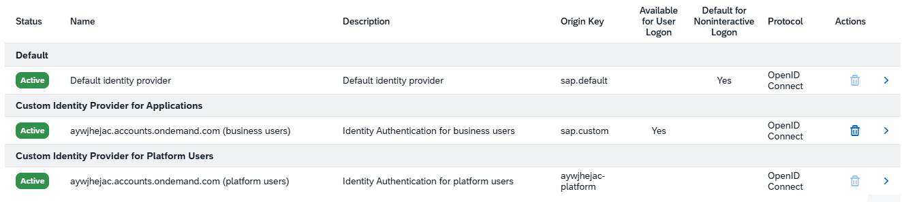
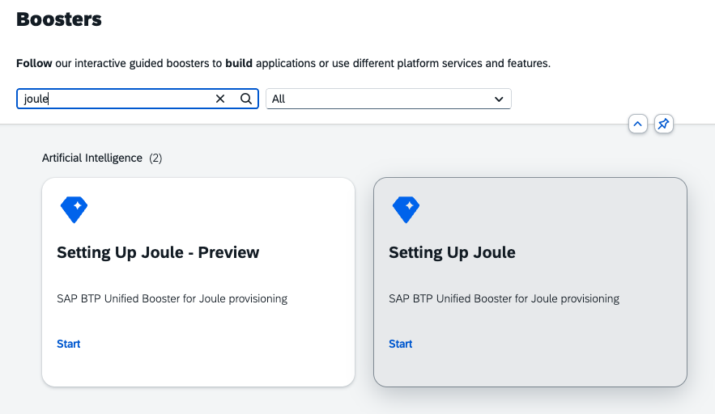

# Setup of Joule and SAP Build Work Zone

> [!IMPORTANT]
> **Disclaimer:** For this exercise, we have already preconfigured Joule and SAP Build Work Zone for you. The steps provided below are for your reference only, and there is no need to perform any actions here.
> Next, proceed to [Develop Agent and Joule Capabilities](../ex1/1.1-Develop-Agent-And-Joule-Capabilities.md) to start building your Pro Code Agent.

## Prerequisites

- You have the global account admin role.
- You have a `HOW-PA Joule Agent nnn` subaccount created and have the admin role.
- You have access to an IAS tenant.
- You have established the trust between the subaccount and IAS tenant.
   1. Verify that the trust has been established for platform users.
   2. Verify that the trust has been established for applications.
   

> [!NOTE]
> If the "Custom Identity Provider for Applications" is missing, choose **Establish Trust**.  
> 1. Choose the **aywjhejac.accounts.ondemand.com** tenant.
> 2. Confirm all default settings and change the description to *Identity Authentication for business users*.
> 3. Edit the **Default identity provider** and remove the *Available for User Logon* indicator.

> [!NOTE]
> For this code jam, the IAS tenant is already added to the system landscape in the global account. The steps below are provided for your reference.
> 1. Navigate to **System Landscapes → Systems** in the global account.
> 2. Choose **Service Owner View**.
> 3. Choose **Add** and select **Add via CLD Discovery**.
> 4. Fill in the following details:
>
>    | Field           | Value                                                                                                                                    |
>    |-----------------|------------------------------------------------------------------------------------------------------------------------------------------|
>    | System Type     | SAP Cloud Identity Services                                                                                                              |
>    | CLD Tenant ID   | Get the tenant ID from [reporting.ondemand.com](https://reporting.ondemand.com/) — search for your IAS tenant and copy the **Tenant ID** |
>
> 5. Choose **Add** to register the system.

> [!TIP]
> **References:**
> - [Create a Subaccount](https://help.sap.com/docs/btp/sap-business-technology-platform/create-subaccount)
> - [Getting Started with Identity Authentication](https://help.sap.com/docs/cloud-identity-services/cloud-identity-services/initial-setup)
> - [Configure Trust to Identity Authentication Tenant](https://help.sap.com/docs/joule/integrating-joule-with-sap/configure-trust-to-identity-authentication-tenant)

## List of Required Entitlements

Add all of the following service plans to your `HOW-PA Joule Agent nnn` subaccount using the steps above.

| Service Display Name                   | Service Technical Name | Service Plan   | Type        | Quantity |
|----------------------------------------|------------------------|----------------|-------------|----------|
| Joule                                  | das-application        | standard       | Application | 1        |
| Joule                                  | das-service            | designer       | Service     | 1        |
| SAP Build Work Zone, standard edition  | SAPLaunchpad           | build-default  | Application | 1        |
| SAP AI Core                            | aicore                 | extended       | Service     | 1        |
| Cloud Foundry Environment              | cloudfoundry           | build-runtime  | Environment | 1        |
| Destination service                    | destination            | lite           | Service     | 1        |

## Setup SAP Build Work Zone

### Create the Subscription

1. Go to **BTP Cockpit → HOW-PA Joule Agent nnn → Services → Instances and Subscriptions**.
2. Choose **Create**.
3. For **Service**, select **SAP Build Work Zone, standard edition**.
4. For **Plan**, select **build-default**.
5. Choose **Create**.
   
### Assign Launchpad_Admin Role

1. Go to **BTP Cockpit → HOW-PA Joule Agent nnn → Security → Role Collections**.
2. Find **Launchpad_Admin** and select it.
3. Choose **Edit**, then under **Users**, add your user.
4. Choose **Save**.

### Login into Workzone

1. Go to **BTP Cockpit → HOW-PA Joule Agent nnn → Services → Instances and Subscriptions**.
2. Choose **SAP Build Work Zone**.
3. Enter credentials **User** as `PRAHOW-<nnn>` and password `as instruced in training`.
4. You should be able to see the `Workzone` portal.

## Run Joule Booster

The Joule Booster provisions Joule services and dependencies in the subaccount. Run it from the **global account**.

1. In your global account, navigate to **Boosters**.
2. Search for **Joule** and open the **Setting Up Joule** booster tile.
3. Choose **Start**.

The booster wizard has six steps:

### Step 1: Check Prerequisites

The booster checks the following automatically:

| Check                                   | Expected Status |
|-----------------------------------------|-----------------|
| Checking Authorizations                 | DONE            |
| Checking Entitlements                   | DONE            |
| Checking Identity Authentication Tenant | DONE            |

All checks must show **DONE** before proceeding.

### Step 2: Set Up Subaccount

Provide the subaccount details:

| Field        | Value                                  |
|--------------|----------------------------------------|
| Entitlements | `das-application` — plan: **standard** |
| Subaccount   | **HOW-PA Joule Agent nnn**             |
| Org          | prahowpa-jannn                         |
| Space        | **dev**                                |

### Step 3: Select Integrations

Select the SAP products where Joule should be enabled:

| Field                        | Value                                     |
|------------------------------|-------------------------------------------|
| Products                     | **SAP Build Work Zone, standard edition** |
| This integration is used for | **Testing**                               |

### Step 4: Select Capabilities

Select the capability packages to be provisioned in Joule:

| Field               | Value                                     |
|---------------------|-------------------------------------------|
| Capability Packages | **SAP Build Work Zone, standard edition** |

### Step 5: Set Up Integrations

Create the formation to connect all systems:

| Field                          | Value                                                                                                           |
|--------------------------------|-----------------------------------------------------------------------------------------------------------------|
| Formation Type                 | Integration with Joule                                                                                          |
| Formation Name                 | `joule-prahowpa-jannn`                                                                                          |
| Joule System                   | Automatically Included                                                                                          |
| Identity Authentication System | Your IAS tenant URL                                                                                             |
| SAP Build Work Zone System     | Your Work Zone subscription (e.g., `UUID - https://<subdomain>.dt.launchpad.cfapps.<region>.hana.ondemand.com`) |

### Step 6: Review

1. Review all the configuration.
2. Choose **Finish** to execute the booster.

> [!TIP]
> **References:**
> - [Run Booster — SAP Help Portal](https://help.sap.com/docs/joule/integrating-joule-with-sap/run-booster)
> - [Integration with SAP Build Work Zone Standard Edition](https://help.sap.com/docs/joule/integrating-joule-with-sap/integration-with-sap-build-work-zone-standard-edition)

## Assign Joule User Roles

Assign the required role collections to your user for accessing Joule and managing capabilities.

1. Go to **BTP Cockpit → HOW-PA Joule Agent nnn → Security → Role Collections**.
2. Choose  **joule_admin**.
3. The following roles would be available :

   | Role                      | Source                   | Purpose                                                                                          |
   |---------------------------|--------------------------|--------------------------------------------------------------------------------------------------|
   | `end_user`                | Joule (DAS) subscription | Allows you to interact with Joule as a consumer, so you can test capabilities you have deployed. |
   | `capability_admin`        | Joule (DAS) subscription | Allows you to manage and deploy capabilities to your Joule instance.                             |
   | `extensibility_developer` | Joule (DAS) subscription | Allows you to develop and publish custom capabilities.                                           |

4. Go to **Security → Users**, select your user `PRAHOW-<nnn>` , and assign the **joule_admin** role collection.

## Create Site in SAP Build Work Zone and Enable Joule

Steps to create the site in SAP Build Work Zone and enable Joule are detailed [here](../ex1/1.3-Agent-Integration-With-Joule.md#create-site-in-sap-build-work-zone-and-enable-joule). This includes creating a site, enabling Joule in the site settings, and ensuring proper configuration for seamless integration.

## Create Digital Assistant Service

To allow developers to deploy custom conversational capabilities for SAP Joule, the Digital Assistant Service (DAS) instance is required.

1. Go to **BTP Cockpit → HOW-PA Joule Agent nnn → Services → Instances and Subscriptions**.
2. Choose **Create**.
3. For **Service**, select **SAP Digital Assistant** (technical name: `das-service`).
4. For **Plan**, select **designer**.
5. For **Runtime Environment**, select **Other**.
6. As **Instance Name**, enter `das-<nnn>`.
7. Choose **Create**.
8. Open the `das-<nnn>` instance. Under **Service Bindings**, choose **Create**.
9. Enter `das-<nnn>-key` as the binding name and choose **Create**.

## Login to Joule CLI

Steps to login to Joule CLI is available [here](../ex1/1.2-Deploy-Agent-And-Joule-Capabilities.md#login-to-joule-cli).

## Conclusion

You have successfully set up Joule and integrated it with the SAP Build Work Zone in your Joule Agent subaccount. This completes the foundational setup required for developing and deploying custom capabilities.

Next, proceed to [Develop Agent and Joule Capabilities](../ex1/1.1-Develop-Agent-And-Joule-Capabilities.md) to start building your Pro Code Agent.
