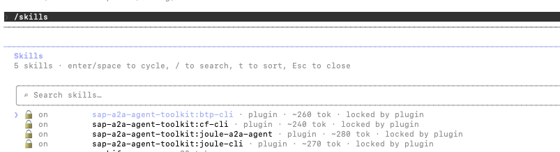

# Develop Pro Code Agent and Joule Capabilities

In this exercise, you use the [Joule A2A Agent Toolkit](https://github.com/SAP-samples/joule-a2a-agent-toolkit) (Claude Code plugin) to scaffold the complete A2A agent project. The toolkit provides pre-built skills that guide Claude Code through generating a production-ready agent.

## Prerequisites

You have already completed the setup of your [local development environment](../ex0/Setup-Local-Environment.md) and [Joule and SAP Build Work Zone](../ex0/Setup-Joule-Workzone.md).

> [!NOTE]
> The following resources have been **pre-provisioned** for you in **HOW-PA Joule Agent nnn Subaccount** and require no action to create:
>
> - SAP BTP Cloud Foundry environment (org: `prahowpa-ja<nnn>`, space: `dev`)
> - Space membership for `prahow-<nnn>@education.cloud.sap` (Space Developer + Space Manager roles)
> - AI Core service instance (`psm-joule-agent-aicore`) with service binding (`psm-joule-agent-aicore-key`)

#### Login to Cloud Foundry

```bash
# Target the Agent subaccount Cloud Foundry endpoint
cf login -a https://api.cf.eu10-005.hana.ondemand.com --origin aywjhejac-platform
# Enter your BTP credentials and select the CF org and space
```

**Which org to select?** When prompted, choose the org `prahowpa-ja<nnn>` and space `dev`.

## Start Claude Code with the Plugin

The Joule A2A Agent Toolkit plugin enables Claude Code to build A2A agents and Joule capabilities. Follow the steps below to set it up:

### Step 1: Navigate to Your Workspace

Open a terminal and navigate to the directory where you have to build your project.

```bash
cd /path/to/your/workspace
```

### Step 2: Copy the Instructions File

Copy the required [Instruction.md](./Instructions.md) file into your working directory.

```bash
cp /path/to/instructions-file/Instruction.md .
```

### Step 3: Run Claude Code with the Plugin

Start Claude Code with the Joule A2A Agent Toolkit plugin loaded.

```bash
claude --plugin-dir /path/to/joule-a2a-agent-toolkit
```

Run **/skills** in claude to verify the joule a2a agent skills.



---

## Build the Agent using the Plugin

Give Claude Code the following prompt. Claude in turn loads the joule-a2a-agent skill (create-agent) and starts building the agent.

> [!IMPORTANT]
> Verify that you are targeting the correct Cloud Foundry organization and space using `cf target`, and ensure the appropriate Joule instance is selected using `joule status` to prevent configuration issues.

```text
Build the joule A2A agent using @Instructions.md
```

> [!NOTE]
> **What is `Instructions.md`?**
> The [instructions file](./Instructions.md) is a structured specification that Claude Code reads as context for building the agent. It is needed because the agent has non-trivial requirements: specific architecture decisions, known edge cases, and strict constraints. These are too complex to express in a single chat prompt. By referencing it with `@Instructions.md`, Claude Code gets the full specification upfront and can generate consistent, production-ready code in one pass.
>
> The file covers:
>
> - **Architecture** — the required `Joule → A2A → LangGraph → MCP → CAP` flow
> - **MCP client** — how to resolve the endpoint and token together, and why tokens must never be cached
> - **LangGraph agent** — `StateGraph` node structure and system prompt rules
> - **Joule v0.2.x compatibility** — middleware to translate legacy `tasks/send` to `message/send`
> - **Multi-turn context** — how to strip `taskId` while preserving `contextId` for conversation continuity
> - **Deployment** — local `.env` setup and Cloud Foundry MTA configuration
> - **Definition of Done** — acceptance criteria the generated code must satisfy

**What is generated:**

```
psm-joule-agent/
├── srv/
│   ├── server.ts              # CAP bootstrap + A2A Express endpoints
│   ├── agent-executor.ts      # LangGraph StateGraph + MCP client
│   ├── service.cds            # CDS service definition
│   └── utils/
│       ├── prompts.ts         # System prompt with CQN format guidance
│       ├── a2aToLangchain.ts  # A2A → LangChain message converter
│       ├── a2a-operations.ts  # A2A event helpers
│       └── helpers.ts
├── joule-capability/
│   ├── capability.sapdas.yaml
│   ├── capability_context.yaml
│   ├── da.sapdas.yaml
│   ├── functions/call_agent.yaml
│   └── scenarios/invoke_agent.yaml
├── package.json
├── tsconfig.json
├── mta.yaml
├── .cdsrc.json
└── .env.example
```

### Overview of Generated Objects

**`srv/server.ts`** — the entry point. It bootstraps the CAP server, registers the A2A JSON-RPC endpoints (`message/send`, `tasks/send`, and `/.well-known/agent.json`), and wires up the agent executor. All incoming requests from Joule or curl arrive here first.

**`srv/agent-executor.ts`** — the brain of the agent. It connects to the CAP application's MCP server using the SAP BTP destination to discover available tools (query, describe, call_action), then builds a LangGraph state machine where the LLM decides which tools to call and in what order to answer the user's question.

**`srv/utils/prompts.ts`** — the system prompt that tells the LLM what it is, what tools are available, how the data model is structured (entities, field names, status codes), and the exact JSON format expected by the CAP MCP query tool. A well-written system prompt is critical for the agent to produce correct queries.

**`joule-capability/`** — the YAML files that register the agent as a capability inside Joule. They tell Joule what questions this agent can answer, which SAP BTP destination to use to reach the agent, and how to map user intents to the `call_agent` function. These are deployed separately using the `joule` CLI in [Exercise 1.2](./1.2-Deploy-Agent-And-Joule-Capabilities.md).

**`mta.yaml`** — the MTA deployment descriptor. It defines the Cloud Foundry app module, memory allocation, service bindings (destination service), and environment variables for the deployed agent.

---

## Test and Troubleshoot the Agent

The agent is generated entirely by Claude Code. Before deploying it, verify it compiles and runs correctly locally and use Claude Code to fix any issues that come up.

Claude generates the agent in the `psm-joule-agent` folder. For all subsequent steps, switch to and continue working from the `psm-joule-agent` directory.

### Step 1:  Open VSCode and Check TypeScript compiles

Open a terminal, navigate to the directory where you have built your project and open vscode.

```bash
cd /path/to/your/workspace
# macOS: open .  |  Windows: explorer . or code .  |  or open VS Code directly: code psm-joule-agent
open .
cd psm-joule-agent
npm install
npx tsc --noEmit
```

If there are type errors, paste the output into Claude Code:

```text
Fix the TypeScript errors: <paste output>
```

### Step 2: Configure the local environment

Copy the sample environment file that is created.

```bash
cp .env.example .env
```

> [!NOTE]  
> If you have already copied the service bindings and saved them in your [Notes](../Notes.md), proceed to the `.env` file and populate the values as per the table below. If not, follow the steps outlined below to retrieve the details and ensure you save them in [Notes](../Notes.md) for future reference.

**To get the Poetry Slam Manager Application Service Broker Key, follow these steps:**

1. Go to **BTP Cockpit → HOW-PA Consumer nnn Subaccount → Services → Instances & Subscriptions**.
2. Choose the `psm-sb-sub<nnn>-full` service instance.
3. Click on `psm-sb-sub<nnn>-full-key` service binding.

**To get the SAP AI Core Service Key, follow these steps:**

1. Go to **BTP Cockpit** → **HOW-PA Joule Agent nnn Subaccount** → **Services** → **Instances & Subscriptions**
2. Choose the `psm-joule-agent-aicore` service instance.
3. Click on `psm-joule-agent-aicore-key` service binding.

Open `.env` and fill in:

| Variable                                | Service Binding of Service Instance | JSON Value                            |
|-----------------------------------------|-------------------------------------|---------------------------------------|
| `AICORE_SERVICE_KEY-serviceurls`        | `SAP AI Core`                       | `serviceurls.AI_API_URL`              |
| `AICORE_SERVICE_KEY-clientid`           | `SAP AI Core`                       | `uaa.clientid`                        |
| `AICORE_SERVICE_KEY-clientsecret`       | `SAP AI Core`                       | `uaa.clientsecret`                    |
| `AICORE_SERVICE_KEY-url`                | `SAP AI Core`                       | `Get uaa.url and append /oauth/token` |
| `PSM_CAP_URL`                           | `Poetry Slam Manager Broker`        | `endpoints.psm-servicebroker`         |
| `PSM_TOKEN_URL/XSUAA_TOKEN_URL`         | `Poetry Slam Manager Broker`        | `Get uaa.url and append /oauth/token` |
| `PSM_CLIENT_ID/XSUAA_CLIENT_ID`         | `Poetry Slam Manager Broker`        | `uaa.clientid`                        |
| `PSM_CLIENT_SECRET/XSUAA_CLIENT_SECRET` | `Poetry Slam Manager Broker`        | `uaa.clientsecret`                    |

### Step 3: Start the agent locally

```bash
npm run watch
```

The agent starts at `http://localhost:<PORT>`. Open a new terminal and verify the agent card is served:

```bash
curl http://localhost:<PORT>/.well-known/agent.json
```

You should get a JSON response with `name`, `description`, and `capabilities`.

### Step 4: Generate test data in the Poetry Slam Manager application

1. Go to **BTP Cockpit → HOW-PA Consumer nnn Subaccount → Services → Instances & Subscriptions**.
2. Click on **Poetry Slam Manager** application subscription.
3. Click on action **Generate Sample data**.

Sample data is available.

### Step 5: Send a test A2A request

> [!NOTE]
> The examples below pipe output through `jq` for readable formatting. `jq` is available on macOS (`brew install jq`) and Linux, but is not installed by default on Windows. On Windows, omit `| jq` to see the raw response, or use the PowerShell alternative at the end of this step.

**Test with `message/send` (A2A v0.3):**

```bash
curl -s -X POST http://localhost:<PORT>/ \
  -H "Content-Type: application/json" \
  -d '{
    "jsonrpc": "2.0",
    "id": "1",
    "method": "message/send",
    "params": {
      "message": {
        "kind": "message",
        "messageId": "m1",
        "role": "user",
        "parts": [{ "kind": "text", "text": "Show me the list of poetry slams" }]
      }
    }
  }' | jq
```

**Test with `tasks/send` (Joule v0.2.x compatibility):**

Joule may send requests using the older `tasks/send` method. This request confirms that the backwards-compatibility middleware correctly translates it to `message/send` internally:

```bash
curl -s -X POST http://localhost:<PORT>/ \
  -H "Content-Type: application/json" \
  -d '{
    "jsonrpc": "2.0",
    "id": "1",
    "method": "tasks/send",
    "params": {
      "id": "t1",
      "contextId": "c1",
      "message": {
        "role": "user",
        "parts": [{ "type": "text", "text": "Show me the list of poetry slams" }],
        "messageId": "m1"
      }
    }
  }' | jq
```

Both responses should contain a completed task with actual poetry slam data from the CAP application.

**Windows PowerShell alternative:**

```powershell
$body = '{"jsonrpc":"2.0","id":"1","method":"message/send","params":{"message":{"kind":"message","messageId":"m1","role":"user","parts":[{"kind":"text","text":"Show me the list of poetry slams"}]}}}'
Invoke-RestMethod -Uri "http://localhost:<PORT>/" -Method POST -ContentType "application/json" -Body $body | ConvertTo-Json -Depth 20
```

### Troubleshooting with Claude Code

If the agent doesn't behave as expected, describe the problem to Claude Code and let it fix the code. Common symptoms are listed below:

| Symptom | Prompt to give to Claude Code |
|---------|---------------------------|
| `401 Unauthorized` from CAP app | The agent gets 401 from the MCP endpoint. Tokens should be cached and reused when fresh, but cleared and re-fetched on a 401 response — check that the 401-retry logic calls `clearCaches()` before retrying. |
| `method not found` for `tasks/send` | Joule sends tasks/send but the agent returns method not found. Add middleware to translate tasks/send to message/send. |
| `Task not found` on second turn | The agent fails with Task not found on follow-up messages. Strip taskId from message/send requests while keeping contextId. |
| Agent returns no data / calls wrong tool | The agent does not call the query tool for list requests. Update the system prompt to call query immediately without calling describe first. |
| TypeScript errors after changes | Fix the TypeScript errors: <paste tsc output> |

---

## Conclusion

You now have developed the agent and tested it locally. The next step is to [deploy the agent and Joule capabilities](./1.2-Deploy-Agent-And-Joule-Capabilities.md).
